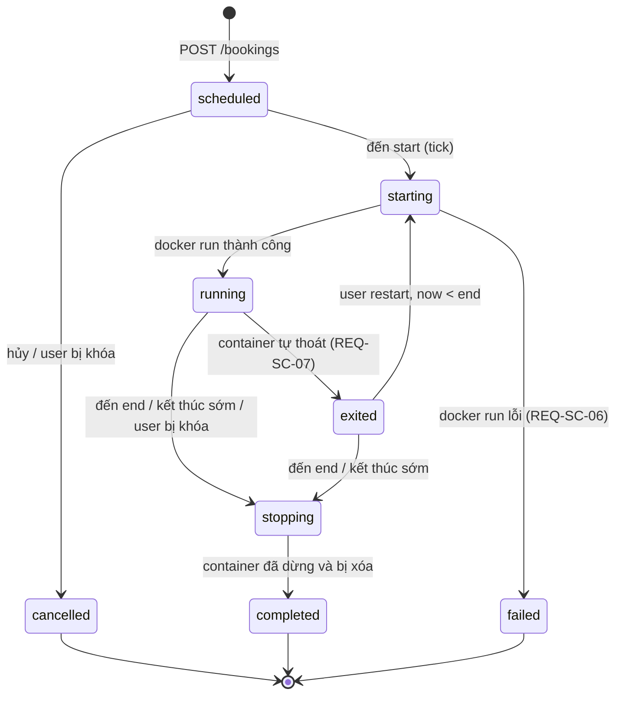

# Scheduler — REQ-SC-01..07

Tiến trình Node.js riêng (`vmu-scheduler.service`), tick mỗi `CFG.SCHEDULER_TICK`.

## Đồng hồ — REQ-SC-08

- Nhịp tick là `setInterval(SCHEDULER_TICK)`. Việc ca nào đến giờ được quyết định bằng truy vấn so sánh thời điểm (`start_at <= now`), **không** tạo cron job theo giờ địa phương cho từng ca.
- `now` lấy một lần đầu mỗi tick (đồng hồ hệ thống, đồng bộ NTP — REQ-DP-06) và truyền vào mọi truy vấn dưới dạng `timestamptz`.
- Việc theo giờ trong ngày (dọn dẹp 03:00) chạy bằng systemd timer có múi giờ tường minh: `OnCalendar=*-*-* 03:00:00 Asia/Ho_Chi_Minh`.
- Nội dung cảnh báo hiển thị giờ Việt Nam: "Ca của bạn kết thúc lúc 11:00 (GMT+7)".
- Khi đồng hồ server bị chỉnh lùi hoặc tiến (NTP), tick kế tiếp vẫn đúng vì chỉ so sánh thời điểm tuyệt đối.

## State machine của ca

Chỉ các chuyển trạng thái trên là hợp lệ; mọi thao tác khác trả `409 INVALID_STATE`.
Ca `exited` vẫn giữ chỗ trong lịch cho tới `end`.

## Một tick

1. `pg_try_advisory_lock(SCHEDULER_LOCK)`; nếu không lấy được khóa (tick trước chưa xong hoặc có tiến trình khác) thì bỏ qua tick này. **REQ-SC-04**
2. **Khởi chạy:** ca `scheduled` có `start_at ≤ now` → `starting` → `docker run` (xem [container.md](container.md)) → `running`, ghi `actual_start_at`. Lỗi → `failed`, lưu lỗi, tạo notification `START_FAILED`. **REQ-SC-01, SC-06**
   - Ca `scheduled` có `end_at ≤ now` (Scheduler đã tắt suốt cả ca) → `failed`.
3. **Cảnh báo:** ca `running` có `end_at − END_WARNING ≤ now` và `warned_at IS NULL` → tạo notification `END_WARNING`, chạy `docker exec <c> sh -c 'echo "…" > /proc/1/fd/1'`, ghi `warned_at`. **REQ-SC-02**
4. **Dừng:** ca `running`/`exited` có `end_at ≤ now` → `stopping` → `docker stop -t STOP_TIMEOUT` → lưu log vào `/var/log/vmu/bookings/<id>.log` → `docker rm` → `completed`, ghi `actual_end_at`. **REQ-SC-03**
5. **Đồng bộ trạng thái:** container của ca `running` đã thoát → `exited`, `exit_reason = OOM` nếu `State.OOMKilled = true`, ngược lại `EXITED`. Không khởi động lại. **REQ-SC-07, MN-04**
6. Nhả khóa.

Container của ca `exited` được giữ lại (để xem log, khởi động lại); khi khởi động lại hoặc hết ca thì lưu log rồi xóa. Mọi cập nhật trạng thái dùng `WHERE status = <trạng thái mong đợi>` để không ghi đè thao tác đồng thời từ API.

Tên container luôn là `vmu-bk-<booking_id>`. `docker run` thất bại vì trùng tên nghĩa là container đã tồn tại; khi đó kiểm tra trạng thái container và không tạo mới.

## Reconcile khi khởi động — REQ-SC-05

1. Liệt kê container có label `vmu.booking`.
2. Container thuộc ca không ở trạng thái `starting`/`running`/`stopping`, hoặc ca có `end_at ≤ now` → dừng theo bước 4.
3. Ca `starting`/`running` có `start_at ≤ now < end_at` mà không có container → chạy lại bước 2.
4. Ca `stopping` → hoàn tất bước 4.
5. Sau đó chạy tick bình thường.

## Giờ GPU đã dùng — REQ-BK-05, BK-08

`gpu_hours_used = (actual_end_at − actual_start_at)` với ca đã `completed`, cắt theo ranh giới tuần. Ca `failed` không tính.
