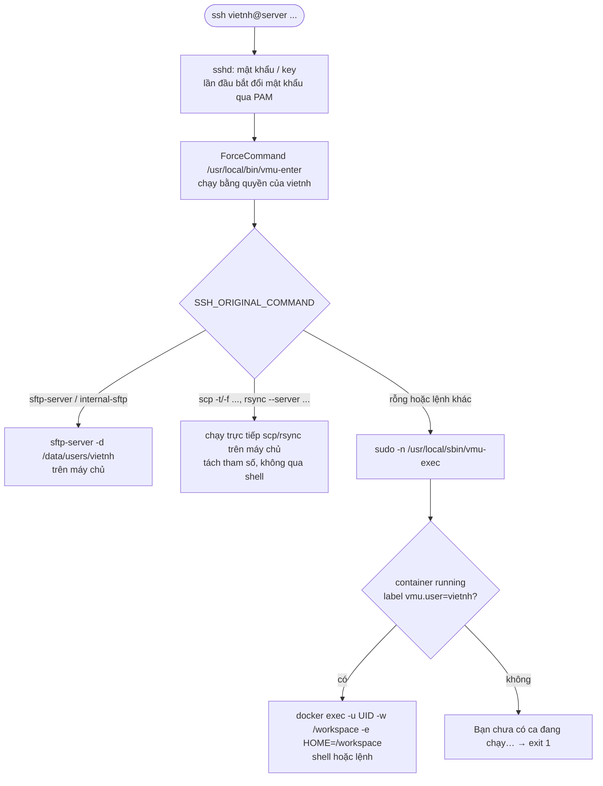

# Truy cập SSH — REQ-CT-08, REQ-CT-09, REQ-CT-10, REQ-SC-02

Người dùng chỉ có một cách vào máy: `ssh <username>@<server>`. Họ không bao giờ có shell trên máy chủ.



## `vmu-enter` (chạy bằng quyền user) — [`deploy/vmu-enter`](../../deploy/vmu-enter)

1. Đọc `SSH_ORIGINAL_COMMAND`, tách thành mảng tham số bằng quy tắc tách từ đơn giản (khoảng trắng, không hiểu `;` `&&` `|` `$()` `` ` ``). **Không bao giờ** đưa chuỗi vào `sh -c` trên máy chủ.
2. Lệnh chép file — REQ-CT-09 — chạy trên máy chủ, thư mục hiện tại `/data/users/<username>`:
   - `internal-sftp` hoặc `*/sftp-server` → `sftp-server -d /data/users/<username>`
   - `scp` có `-t` hoặc `-f` (scp bản cũ) → `scp <tham số>`
   - `rsync --server …` → `rsync --server <tham số>`
3. Còn lại → `exec sudo -n /usr/local/sbin/vmu-exec -- "$SSH_ORIGINAL_COMMAND"`.

## `vmu-exec` (root, qua sudo) — [`deploy/vmu-exec`](../../deploy/vmu-exec)

- Tên user lấy từ `SUDO_USER` (do sudo đặt), **không** nhận tên user hay tên container từ tham số.
- Tìm container: `docker ps --filter label=vmu.user=$SUDO_USER --filter status=running`.
- Không có → in thông báo, `exit 1`.
- Có: `docker exec [-t nếu stdin là TTY] -i -u <uid>:<uid> -w /workspace -e HOME=/workspace -e TERM <container>` rồi:
  - không có lệnh → `bash -l` (không có bash thì `sh -l`);
  - có lệnh → `sh -c "<lệnh>"` **bên trong container** (an toàn: container đã bị giới hạn).
- sudoers: `%vmu-users ALL=(root) NOPASSWD: /usr/local/sbin/vmu-exec`.

## sshd

`/etc/ssh/sshd_config.d/50-vmu.conf` (cố định):

```
Match Group vmu-users
    ForceCommand /usr/local/bin/vmu-enter
    PasswordAuthentication yes
    KbdInteractiveAuthentication yes
    X11Forwarding no
    AllowAgentForwarding no
    AllowStreamLocalForwarding no
    PermitTunnel no
    GatewayPorts no
    AllowTcpForwarding local
    PermitOpen none
```

`/etc/ssh/sshd_config.d/40-vmu-users.conf` (**tự sinh**, đứng trước file 50 nên `PermitOpen` riêng của từng user thắng `PermitOpen none`):

```
Match User vietnh
    PermitOpen localhost:10000 127.0.0.1:10000 localhost:10001 127.0.0.1:10001 … localhost:10099 127.0.0.1:10099
```

- Sinh bằng hàm thuần `renderSshdUsers(users, cfg)` ở `backend/src/system/sshd.js`: mỗi user `active` hoặc `locked` có một khối; user `pending`, `deleted` không có.
- Ghi lại sau mỗi lần duyệt, xóa user: `vmu-provision write-sshd-users` (nội dung qua stdin, kiểm định dạng từng dòng, chạy `sshd -t` rồi `systemctl reload ssh`).
- `UsePAM yes` trong cấu hình chính: mật khẩu hết hạn (`chage -d 0`) được đổi trong bước xác thực, trước khi `ForceCommand` chạy (REQ-US-11).
- Kiểm tra cấu hình hiệu lực: `sshd -T -C user=vietnh,host=x,addr=1.2.3.4 | grep -i permitopen`.

## Cổng — REQ-CT-05, REQ-CT-10

- Container publish `-p 127.0.0.1:p:p`: chỉ tiến trình trên máy chủ (tức sshd khi forward) tới được.
- Người dùng: `ssh -L 10001:localhost:10001 vietnh@server`, rồi mở `http://localhost:10001` trên máy mình.
- Forward tới cổng ngoài dải → sshd trả `administratively prohibited`.

## Cảnh báo hết ca trên terminal — REQ-SC-02

Scheduler chạy trong container (bằng UID của user):

```sh
for t in /dev/pts/[0-9]*; do [ -w "$t" ] && printf '\n[VMU] %s\n' "$MSG" > "$t"; done
echo "[VMU] $MSG" > /proc/1/fd/1
```

Các phiên `docker exec -t` của user có pts thuộc user nên ghi được.

## Quyền thư mục — REQ-CT-09

- `/data/users` : `root:root 0711` (đi qua được, không liệt kê được).
- `/data/users/<username>` : `<uid>:<uid> 0700`.
- User thuộc nhóm `vmu-users`, **không** thuộc nhóm `docker`.
