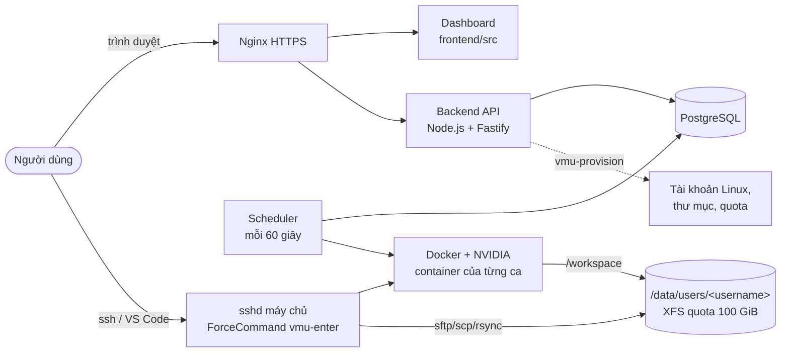
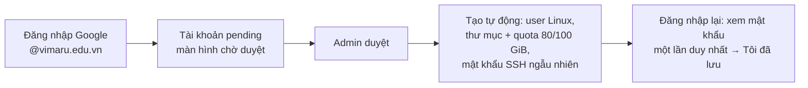
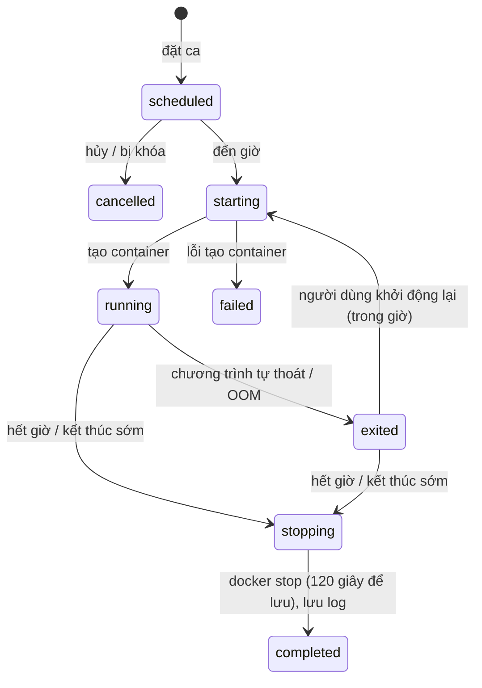

# Tổng quan hệ thống — VMU GPU Server

Tài liệu tóm tắt **mục đích** và **các luồng chính** của hệ thống ở trạng thái hiện tại. Chi tiết đầy đủ: [SPEC](00-spec/SPEC.md) (yêu cầu), [docs/10-design](10-design/) (thiết kế), [test case](20-test-cases/README.md).

## 1. Mục đích

Trường có **một máy chủ GPU RTX 5090** (64 GB RAM) cho khoảng **30 người** dùng chung. Hệ thống giải quyết ba việc:

1. **Chia thời gian công bằng:** người dùng đặt ca theo giờ; tại mỗi thời điểm tối đa **2 phiên**, trong đó tối đa **1 phiên dùng GPU**; mỗi người tối đa **10 giờ GPU/tuần**.
2. **Cách ly:** mỗi người làm việc trong **container riêng**, thư mục dữ liệu riêng (100 GiB), không thấy dữ liệu hay tiến trình của người khác, không có quyền trên máy chủ.
3. **Tự động hóa:** container tự bật khi đến giờ, cảnh báo trước 15 phút, tự tắt khi hết giờ — không cần quản trị viên can thiệp.

## 2. Ai dùng hệ thống

| Vai trò | Làm gì |
|---|---|
| **Người dùng** (sinh viên, giảng viên có email `@vimaru.edu.vn`) | Đặt ca, SSH / VS Code vào máy, chạy code, train model, chép dữ liệu |
| **Quản trị viên** | Duyệt / khóa / xóa tài khoản, xem nhật ký, cập nhật image chung |
| **Scheduler** (tự động) | Bật / tắt container theo lịch, cảnh báo, theo dõi dung lượng |

## 3. Thành phần

## 4. Luồng chính

### 4.1. Có tài khoản

- Tên đăng nhập SSH = phần trước `@vimaru.edu.vn` (vd `VietNH@…` → `vietnh`).
- Chỉ email trường, đã xác minh, mới đăng nhập được (kiểm tra ở backend, không tin tham số trên URL).
- Lần SSH đầu tiên phải đổi mật khẩu. Quên thì cấp lại trên Dashboard.

### 4.2. Đặt ca

1. Mở **Lịch** (trang chính): thấy 8 ngày tới, mỗi ca là một khối ghi **ai đang dùng** và có GPU hay không.
2. Bấm vào khoảng trống (hoặc nút **Đặt ca**) → chọn **ngày, từ giờ, đến giờ, có dùng GPU không**.
3. Hệ thống kiểm tra:

| Quy tắc | Lỗi nếu vi phạm |
|---|---|
| Giờ tròn, dài 1–8 giờ, được qua nửa đêm | `INVALID_TIME` |
| Không đặt giờ đã bắt đầu (09:20 thì đặt từ 10:00), tối đa trước 7 ngày | `INVALID_TIME` |
| Mình không có ca khác chồng giờ | `USER_OVERLAP` |
| Không chồng với ca GPU của người khác | `GPU_BUSY` |
| Mọi thời điểm tối đa 2 phiên | `SLOT_FULL` |
| ≤ 10 giờ GPU/tuần (tuần từ Thứ Hai 00:00); khung GPU trong 24 giờ tới được đặt vượt | `GPU_QUOTA_EXCEEDED` |

- Mọi giờ là **giờ Việt Nam (GMT+7)**, kể cả khi máy người dùng đặt múi giờ khác.
- Hai người bấm cùng lúc vào cùng một chỗ trống: chỉ một người được (khóa trong CSDL).
- Hủy ca trước giờ → khung giờ trả lại ngay.

### 4.3. Vòng đời một ca

- **Container mỗi ca:** image chung, chạy bằng UID của người dùng (không root), RAM 28 GiB không swap, CPU chia đôi, GPU chỉ khi ca có GPU, không mở cổng ra ngoài, không nói chuyện được với container khác.
- **Còn 15 phút:** thông báo trên Dashboard + in ra mọi terminal đang mở trong container.
- **Hết giờ:** mọi tiến trình dừng; dữ liệu trong `/workspace` giữ nguyên. Train dài thì lưu checkpoint và `--resume` ở ca sau.
- **OOM / lỗi:** ca ghi rõ lý do, người dùng nhận thông báo; không tự khởi động lại.

### 4.4. Làm việc trong ca

| Cách | Lệnh | Ghi chú |
|---|---|---|
| **Terminal** | `ssh vietnh@gpu.vimaru.edu.vn` | Mật khẩu hoặc key; vào thẳng container, tại `/workspace` |
| **VS Code** | `~/.ssh/config`: `Host vmu` … `ProxyCommand ssh vietnh@… vmu-connect` → *Connect to Host → vmu* | Cần SSH key; terminal, extension, notebook, chuyển tiếp cổng đều trong container |
| **Jupyter / TensorBoard** | VS Code tự mở cổng, hoặc `ssh -L 8888:localhost:8888 vmu` | Không có dải cổng riêng; cổng chỉ tới được qua SSH của chính mình |
| **Chép file** | `sftp`, `scp`, `rsync` tới `vietnh@gpu…` | Dùng được **cả khi không có ca** |

Không có ca: SSH báo "Bạn chưa có ca đang chạy" (chỉ chép file được). Người dùng **không bao giờ** có shell trên máy chủ.

### 4.5. Cài phần mềm

Không có quyền root trong container, nhưng `HOME=/workspace` nên mọi thứ tự cài đều còn ở ca sau:

- `pip install …`, `conda create -n ml python=3.12`
- `conda install -c conda-forge ffmpeg gcc cmake nodejs …` (thay cho phần lớn nhu cầu `apt`)
- Công cụ cài vào `~/.local`, biên dịch với `--prefix=$HOME/.local`
- Thứ bắt buộc cần root → nhờ admin thêm vào **image chung** ([deploy/base-image](../deploy/base-image/Dockerfile)).

### 4.6. Dung lượng, thông báo, quản trị

- **Dung lượng:** đọc quota mỗi 5 phút. Vượt 80 GiB → cảnh báo kèm hạn dọn 7 ngày; quá hạn thì không ghi thêm được. Chạm 100 GiB → không ghi được. **Server không sao lưu** — người dùng tự sao lưu.
- **Thông báo** (chuông trên Dashboard): sắp hết ca, không khởi chạy được, OOM, vượt dung lượng.
- **Quản trị:** duyệt / khóa (hủy ca sắp tới, dừng phiên đang chạy) / xóa (giữ dữ liệu 30 ngày, UID không cấp lại); nhật ký mọi thao tác quan trọng (không chứa mật khẩu).
- **Ca của tôi:** xem ca đang chạy / sắp tới / đã xong, hủy, kết thúc sớm, khởi động lại, xem log và số liệu CPU/RAM/GPU.

## 5. Nguyên tắc an toàn

| Rủi ro | Cách chặn |
|---|---|
| Đăng nhập bằng email ngoài trường | Kiểm tra chữ ký token Google, `hd` và đuôi email ở backend |
| Lộ mật khẩu SSH | Hiện một lần, không lưu bản rõ trong CSDL/log, header `no-store` |
| Người dùng chiếm máy chủ | Không có shell máy chủ (`ForceCommand`), không thuộc nhóm `docker`, container không root, `no-new-privileges` |
| Chèn lệnh qua SSH | Lệnh chép file tách tham số, không qua shell máy chủ |
| Xem dữ liệu / container người khác | Thư mục `0700`, container gắn label theo user, mạng tắt giao tiếp giữa container |
| Một người chiếm hết máy | Giới hạn 2 phiên, 1 GPU, 28 GiB RAM/phiên, 10 giờ GPU/tuần, quota 100 GiB |

## 6. Giao diện: bảng màu

Màu lấy từ **logo VMU** ([`icon.svg`](../../icon.svg): xanh `#0001fe`, đỏ `#fe0103` trên nền trắng), làm dịu đi để dễ nhìn lâu. Mọi màu khai báo một chỗ dưới dạng biến CSS trong [`frontend/src/styles.css`](../frontend/src/styles.css) (`:root`); component chỉ dùng biến, không ghi mã màu trực tiếp. Hiện chỉ có giao diện sáng.

### Màu thương hiệu

| Biến | Mã | Dùng cho |
|---|---|---|
| `--brand` | `#1f2bd0` | Màu chủ đạo: nút chính, mục menu đang chọn, **ca của bạn** trên lịch, ngày hôm nay, liên kết |
| `--brand-strong` | `#161fa3` | Hover/nhấn nút chính, chữ trên nền xanh nhạt |
| `--brand-soft` | `#eceefe` | Nền mục menu đang chọn, ô lịch khi rê chuột |
| `--brand-softer` | `#f6f7ff` | Nền cột "hôm nay", hover nhẹ, khung tóm tắt |
| `--vmu-red` | `#e0101f` | **Chỉ làm điểm nhấn thương hiệu**: vạch "bây giờ" trên lịch, số thông báo chưa đọc, dải màu đầu trang đăng nhập |

Xanh `#1f2bd0` là bản dịu của `#0001fe` (xanh thuần quá gắt khi nhìn lâu) mà vẫn đủ tương phản. Đỏ VMU không dùng cho nút hay chữ thường để không bị nhầm với báo lỗi.

### Màu ngữ nghĩa (trạng thái)

| Biến | Chữ / nền nhạt | Dùng cho |
|---|---|---|
| `--danger` / `--danger-soft` | `#c3161c` / `#fdecec` | Lỗi, thao tác nguy hiểm (Hủy ca, Xóa, Kết thúc sớm), vượt dung lượng, OOM |
| `--success` / `--success-soft` | `#067647` / `#e6f5ed` | Ca đang chạy |
| `--warning` / `--warning-soft` | `#9a5305` / `#fff3de` | Đang khởi chạy / đang dừng, chưa có SSH key, cảnh báo hết ca |

Trạng thái **luôn có chữ đi kèm** (vd "Đang chạy", "Đã hủy"), không chỉ dựa vào màu.

### Màu trung tính

| Biến | Mã | Dùng cho |
|---|---|---|
| `--text` | `#0f172a` | Chữ chính; nền khối code và chip "GPU" |
| `--text-muted` | `#4b5567` | Chữ phụ, nhãn, mô tả |
| `--text-subtle` | `#647083` | Chữ rất phụ (giờ trên trục lịch, ghi chú), cỡ ≥ 13px |
| `--border` / `--border-strong` | `#e2e5ee` / `#cbd1de` | Đường kẻ, viền thẻ / viền ô nhập, nút phụ |
| `--surface` | `#ffffff` | Nền thẻ, hộp thoại, lịch |
| `--bg` | `#f5f6fa` | Nền trang |

### Màu trên lịch

| Thành phần | Màu |
|---|---|
| Ca của bạn | Nền `--brand`, chữ trắng |
| Ca người khác | Nền `#e9ecf4`, chữ `#1f2937`, vạch trái `#9aa3b5` |
| Ca có GPU | Chip "GPU" nền `#0f172a` chữ trắng (trên ca của bạn: nền trắng chữ xanh); ca người khác có GPU thì vạch trái đậm `#0f172a` |
| Cột hôm nay | Nền `--brand-softer`, ngày ghi trong viên thuốc `--brand` |
| Giờ đã qua | Phủ xám rất nhạt, không bấm được |
| Thời điểm hiện tại | Vạch ngang `--vmu-red` có chấm tròn |

### Độ tương phản (WCAG)

Tính theo công thức WCAG 2.x; ngưỡng AA cho chữ thường là 4.5:1.

| Cặp màu | Tỉ lệ |
|---|---|
| `--text` trên trắng | 17.9:1 |
| `--text-muted` trên trắng | 7.5:1 |
| `--text-subtle` trên trắng / trên `--bg` | 5.0:1 / 4.6:1 |
| `--brand` trên trắng, chữ trắng trên `--brand` | 9.1:1 |
| `--brand-strong` trên `--brand-soft` | 10.4:1 |
| `--danger` / `--success` / `--warning` trên nền nhạt tương ứng | 5.3:1 / 5.1:1 / 5.3:1 |
| Chữ ca người khác trên nền khối | 12.4:1 |
| `--vmu-red` trên trắng | 4.9:1 |

### Các thành phần khác

- **Font:** Inter (có tiếng Việt), dự phòng font hệ thống; số dùng chữ số đều độ rộng (`tabular-nums`) để giờ không nhảy.
- **Icon:** SVG nét 1.75, một bộ duy nhất, không dùng emoji.
- **Bo góc:** 6 / 10 / 14 px (`--radius-sm`, `--radius`, `--radius-lg`); đổ bóng nhẹ `--shadow-1` cho thẻ.
- **Focus bàn phím:** viền `0 0 0 3px` màu `--brand` độ trong 35% (`--focus`).
- **Chuyển động:** ngắn (120–200 ms); tắt khi người dùng bật "giảm chuyển động" (`prefers-reduced-motion`).

## 7. Trạng thái hiện tại (2026-09-29)

| Module | Nội dung | Test case đã đạt |
|---|---|---|
| M1 Người dùng | Google, duyệt, mật khẩu, SSH key, khóa/xóa | 24/29 |
| M2 Đặt lịch | Quy tắc đặt ca, múi giờ, hạn mức GPU, lịch | 39/40 |
| M3 Scheduler | Bật/tắt, cảnh báo, reconcile | 11/15 |
| M4 Container & SSH | Lệnh docker, SSH vào container, VS Code | 7/22 |
| M5 Lưu trữ | Quota, cảnh báo | 1/7 |
| M6 Giám sát | Log, số liệu, audit, thông báo | 7/8 |
| M7 Dashboard | Giao diện (e2e Playwright) | 12/12 |
| M8 Triển khai | systemd, Nginx, tài liệu người dùng | 0/6 |
| **Tổng** | | **101/139** |

Phần chưa đạt chủ yếu là **test `system` cần máy chủ thật** (GPU, XFS quota, SSH thật, mạng Docker) và **M8 Triển khai**. Chạy thử giao diện trên máy local: `npm run db:test` rồi `npm run dev` → http://127.0.0.1:4174/__dev.
