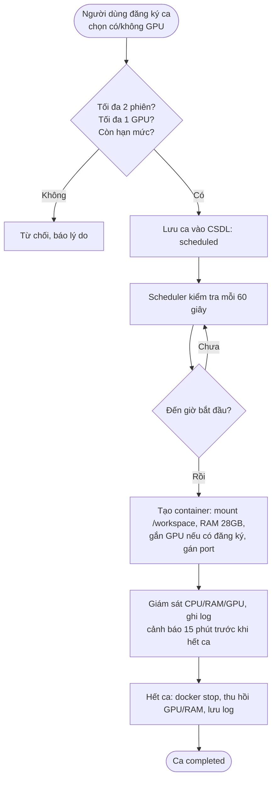

# Kế hoạch triển khai và sử dụng Server tại Đại học Hàng hải Việt Nam

**Tác giả:** Nguyễn Hữu Việt

---

## 1. Mục tiêu hệ thống

Hệ thống server được triển khai nhằm khai thác tối đa hiệu năng GPU và cách ly môi trường làm việc giữa khoảng **30 người dùng**.

- **Tối ưu GPU:** RTX 5090 được cấp phát theo lịch đăng ký, tại mỗi thời điểm chỉ một phiên được dùng GPU.
- **Cách ly:** Mỗi người dùng có container, thư mục dữ liệu, hạn mức lưu trữ và dải cổng riêng.
- **Chia sẻ công bằng:** Tối đa 2 phiên chạy đồng thời, có hạn mức giờ GPU theo tuần.

## 2. Cấu hình phần cứng

| Thành phần   | Cấu hình                    | Ghi chú                                  |
|--------------|-----------------------------|------------------------------------------|
| GPU          | NVIDIA RTX 5090 (32GB VRAM) | Chỉ 1 phiên sử dụng tại một thời điểm    |
| RAM          | 64GB DDR5                   | Chia cho tối đa 2 phiên + hệ điều hành   |
| Storage OS   | 1TB NVMe SSD                | OS, Docker images                        |
| Storage Data | 4TB HDD/SSD                 | Dữ liệu người dùng                       |

## 3. Tài khoản và xác thực

### 3.1. Đăng nhập Dashboard bằng Google

Đăng nhập bằng Google (OAuth 2.0 / OpenID Connect), **chỉ chấp nhận email `@vimaru.edu.vn`**. Kiểm tra ở backend trên ID token, không dựa vào giao diện:

- Xác thực chữ ký và `aud` của ID token (`google-auth-library`).
- `email_verified = true`.
- Claim `hd = vimaru.edu.vn` **và** email kết thúc đúng bằng `@vimaru.edu.vn`. Tên miền con (`@sv.vimaru.edu.vn`) hay `@gmail.com` bị từ chối.

> Tham số `hd` trong URL đăng nhập chỉ để Google gợi ý tài khoản; người dùng sửa được URL nên không dùng làm cơ chế kiểm tra.

Thông tin tự lấy từ Google: họ tên, email, ảnh đại diện.

### 3.2. Tên đăng nhập

Tên đăng nhập (SSH, tài khoản Linux) = **phần trước `@vimaru.edu.vn`**, chuyển về chữ thường. Ví dụ `VietNH@vimaru.edu.vn` → `vietnh`.

Điều kiện hợp lệ: chỉ gồm `a-z 0-9 . _ -`, bắt đầu bằng chữ cái, tối đa 32 ký tự, không trùng tên hệ thống (`root`, `admin`, `docker`, `nginx`, …). Không hợp lệ → báo lỗi, quản trị viên xử lý thủ công.

### 3.3. Tạo tài khoản lần đầu

Server chỉ phục vụ ~30 người (quota và dải cổng tính theo con số này) nên tài khoản mới cần duyệt:

1. Đăng nhập Google lần đầu → lưu thông tin, trạng thái `pending`.
2. Quản trị viên duyệt → tự động cấp phát: tài khoản Linux với UID riêng, thư mục `/data/users/<username>` + quota 80/100 GiB, dải cổng tiếp theo còn trống, mật khẩu ngẫu nhiên.
3. Lần đăng nhập Dashboard tiếp theo → hiển thị mật khẩu.

### 3.4. Mật khẩu SSH lần đầu

Dashboard đăng nhập bằng Google; mật khẩu chỉ dùng để **SSH**.

- Sinh ngẫu nhiên 16 ký tự bằng `crypto.randomBytes`.
- **Chỉ hiển thị một lần** trên Dashboard, có nút sao chép và cảnh báo lưu lại. Sau khi người dùng xác nhận đã lưu thì không xem lại được.
- Chỉ lưu dạng băm trong `/etc/shadow`; không lưu bản rõ trong CSDL, không ghi log. Response có `Cache-Control: no-store`.
- Bắt đổi mật khẩu ở lần SSH đầu (`chage -d 0`).
- Quên mật khẩu: đăng nhập Google → "Cấp lại mật khẩu", mật khẩu mới cũng chỉ hiện một lần.
- Khuyến nghị thêm SSH key qua Dashboard.

## 4. Mô hình phiên làm việc và tài nguyên

### 4.1. Một loại workload duy nhất: Compute

Mỗi ca đăng ký tương ứng với một container, khởi chạy khi bắt đầu ca và **dừng hoàn toàn** khi hết ca. Không có container chạy lâu dài ngoài ca.

Khi đăng ký, người dùng **bắt buộc chọn có dùng GPU hay không** (phiên không GPU dùng cho tiền xử lý dữ liệu, chạy thử code, đánh giá mô hình nhỏ).

### 4.2. Quy tắc đồng thời

- Tại mọi thời điểm có **tối đa 2 phiên** đang chạy.
- Trong đó **tối đa 1 phiên dùng GPU**.
- Một người dùng không được có 2 ca chồng thời gian.

| Tổ hợp tại một thời điểm | Hợp lệ |
|--------------------------|--------|
| GPU + không GPU          | ✅     |
| Không GPU + không GPU    | ✅     |
| Một phiên bất kỳ         | ✅     |
| GPU + GPU                | ❌     |
| 3 phiên trở lên          | ❌     |

### 4.3. Định mức tài nguyên

Nếu cấp đúng 30GB/phiên thì 2 phiên dùng 60GB, host (OS, Docker, Scheduler, Nginx) chỉ còn ~4GB — dễ thiếu bộ nhớ. Đề xuất giới hạn cứng **28GB/phiên** (2 × 28 = 56GB), dành **8GB cho host**. Khi nâng cấp lên 128GB RAM có thể tăng lên 30GB/phiên hoặc hơn.

| Loại phiên        | RAM               | GPU          | Số phiên tối đa        |
|-------------------|-------------------|--------------|------------------------|
| Compute + GPU     | 28GB (không swap) | 1 × RTX 5090 | 1                      |
| Compute không GPU | 28GB (không swap) | Không        | 2 (tính cả phiên GPU)  |

- **CPU:** mỗi phiên `⌊(N − 2) / 2⌋` lõi, `N` là số luồng CPU của server; 2 luồng dành cho host.
- **RAM:** `--memory=28g --memory-swap=28g` (tắt swap). Vượt giới hạn chỉ tiến trình trong container bị OOM, host không ảnh hưởng.
- **Shared memory:** `--shm-size=8g` cho DataLoader PyTorch (tính trong 28GB).
- **GPU:** chỉ phiên có đăng ký GPU mới gắn `--gpus device=0`; phiên không GPU không nhìn thấy GPU.

### 4.4. Hạn mức sử dụng (đề xuất, cấu hình được)

GPU chỉ có 7 × 24 = 168 giờ/tuần cho 30 người (~5,6 giờ/người nếu tất cả cùng dùng), nên cần giới hạn:

| Tham số                 | Giá trị mặc định                                           |
|-------------------------|------------------------------------------------------------|
| Độ dài ca               | Đăng ký theo giờ tròn "từ mấy giờ đến mấy giờ" (vd 08:00 – 11:00), 1 – 8 giờ, được qua nửa đêm |
| Hạn mức GPU             | 10 giờ/tuần/người; khung GPU trống trong 24h tới được đặt vượt |
| Đặt trước tối đa        | 7 ngày                                                     |
| Cảnh báo trước khi hết ca | 15 phút                                                  |
| Thời gian chờ khi dừng  | 120 giây (`docker stop -t 120`)                            |

### 4.5. Thời gian và múi giờ

- Mọi giờ trong hệ thống là **giờ Việt Nam (GMT+7, `Asia/Ho_Chi_Minh`)**: lịch trên Dashboard, giờ bắt đầu/kết thúc ca, ranh giới ngày, tuần tính hạn mức GPU (bắt đầu Thứ Hai 00:00). Người dùng ở nước ngoài hoặc máy đặt sai múi giờ vẫn thấy giờ Việt Nam.
- Bên trong hệ thống lưu thời điểm dạng UTC; chỉ đổi sang giờ Việt Nam khi hiển thị hoặc khi áp dụng quy tắc theo lịch. Hệ thống chạy đúng dù server đặt múi giờ nào.
- Đồng hồ server đồng bộ NTP để ca bắt đầu và kết thúc đúng giờ.

## 5. Cấu trúc lưu trữ và mạng

### 5.1. Phân vùng dữ liệu

```
/data/users/vietnh/     -> mount vào container tại /workspace
/data/users/hoanglm/
...
/data/shared/          -> mount read-only tại /shared (dataset, model dùng chung)
```

### 5.2. Hạn mức lưu trữ cho 30 người dùng

Ổ 4TB thực tế chỉ khoảng 3,64 TiB ≈ 3.725 GiB.

| Hạng mục                         | Dung lượng     | Ghi chú                        |
|----------------------------------|----------------|--------------------------------|
| Dung lượng thực ổ 4TB            | ≈ 3.725 GiB    |                                |
| Dự phòng hệ thống file (10%)     | ≈ 375 GiB      | Giữ hiệu năng, tránh đầy ổ     |
| Dữ liệu dùng chung `/data/shared`| 300 GiB        | Dataset, model dùng chung      |
| Còn lại cho người dùng           | ≈ 3.050 GiB    |                                |
| **Mỗi người (30 người)**         | **100 GiB**    | 3.050 / 30 ≈ 101 GiB           |

Chính sách quota mỗi người:

- **Soft quota 80 GiB:** cảnh báo trên Dashboard, có 7 ngày để dọn dẹp. Quá 7 ngày mà vẫn vượt 80 GiB thì không ghi thêm được cho tới khi xuống dưới 80 GiB (grace period của XFS).
- **Hard quota 100 GiB:** không ghi thêm được khi chạm mức.
- Triển khai bằng **XFS project quota** trên từng thư mục `/data/users/<username>`.
- Checkpoint nên chỉ giữ vài bản gần nhất.

Ổ NVMe 1TB:

- Writable layer mỗi container giới hạn 20GB (`--storage-opt size=20G`, yêu cầu `/var/lib/docker` trên XFS bật `pquota`). Dữ liệu cần giữ phải nằm trong `/workspace`.
- Image được build từ base image đã duyệt (CUDA, PyTorch); image không dùng quá 30 ngày bị dọn định kỳ.
- Nếu ổ Data là HDD, cân nhắc chép dataset sang vùng tạm trên NVMe trong ca để tăng tốc đọc.

> Server **không sao lưu** dữ liệu người dùng. Người dùng tự sao lưu code và kết quả quan trọng.

### 5.3. Cấp phát cổng mạng

Mỗi người có 100 cổng cho Jupyter, TensorBoard, API thử nghiệm. Người dùng được duyệt thứ `i` (1..30):

```
[10000 + 100·(i−1),  10000 + 100·(i−1) + 99]
```

| Người dùng | Dải port      |
|------------|---------------|
| User 01    | 10000 – 10099 |
| User 02    | 10100 – 10199 |
| …          | …             |
| User 30    | 12900 – 12999 |

Container chỉ được publish cổng trong dải của chính người dùng đó.

## 6. Hệ thống điều phối (Scheduler)

Node.js + `node-cron`, chu kỳ 60 giây:

- Khởi chạy container đúng giờ bắt đầu ca (trễ ≤ 60 giây).
- Cảnh báo 15 phút trước khi hết ca để lưu checkpoint.
- Dừng container khi hết ca, thu hồi GPU.
- Khi khởi động lại: **reconcile** — dừng container không có ca hợp lệ, khởi chạy lại container cho ca đang diễn ra.
- Mỗi lượt kiểm tra có **lock** để không tạo 2 container cho cùng một ca.

## 7. Quy trình đăng ký và kích hoạt ca

### Bước 1: Người dùng đăng ký ca

Thông tin: thời gian bắt đầu/kết thúc, **có dùng GPU hay không**, image (từ danh sách cho phép).

Kiểm tra trong một transaction có khóa:

1. Thời gian hợp lệ: giờ tròn, không ở quá khứ (đang 09:20 thì phải đặt từ 10:00), dài 1 – 8 giờ, được qua nửa đêm, không đặt trước quá 7 ngày.
2. Người dùng không có ca khác chồng thời gian.
3. **Giới hạn 2 phiên:** tại mọi thời điểm `t` trong `[s, e)` của ca mới, số ca đang hiệu lực chứa `t` cộng 1 phải ≤ 2. Phải quét theo mốc thời gian, không chỉ đếm số ca chồng lên. Ví dụ: đã có 08:00–10:00 và 10:00–12:00 thì 09:00–11:00 vẫn hợp lệ.
4. **Giới hạn GPU:** ca mới có GPU thì không được chồng lên ca GPU nào khác.
5. Hạn mức giờ GPU trong tuần (nếu ca có GPU).

Hợp lệ → lưu với trạng thái `scheduled`. Không hợp lệ → trả lý do cụ thể (`SLOT_FULL`, `GPU_BUSY`, `GPU_QUOTA_EXCEEDED`, …).

### Bước 2: Scheduler giám sát lịch

Mỗi 60 giây: tìm ca đến giờ chưa có container, ca sắp hết giờ (15 phút) để cảnh báo, ca đã hết giờ mà container vẫn chạy.

### Bước 3: Kích hoạt container

1. Tạo container từ image đã chọn, chạy với UID người dùng (không root, không `--privileged`).
2. Mount `/data/users/<username>` → `/workspace`, `/data/shared` → `/shared` (read-only).
3. Ca có GPU: gắn GPU qua NVIDIA Container Toolkit. Không GPU: không gắn.
4. Giới hạn CPU, RAM 28GB không swap, shm 8GB.
5. Gán cổng trong dải của người dùng.

### Bước 4: Giám sát

Trạng thái container (running/exited/OOM), CPU/RAM/GPU, dung lượng lưu trữ, log. Container tự thoát trước giờ thì **không tự khởi động lại**; người dùng có thể chủ động khởi động lại trong ca.

### Bước 5: Kết thúc ca

1. `docker stop -t 120` — 120 giây để lưu dữ liệu trước khi bị buộc dừng.
2. Giải phóng GPU, CPU, RAM.
3. Lưu log, chuyển ca sang `completed`.

Dữ liệu trong `/workspace` được giữ nguyên. Người dùng có thể hủy ca trước giờ hoặc kết thúc sớm để nhường tài nguyên.

### Tóm tắt luồng



## 8. Công nghệ triển khai

- **Virtualization:** Docker + NVIDIA Container Toolkit.
- **Storage:** XFS project quota cho thư mục người dùng và writable layer container.
- **Backend:** Node.js — Management API và Scheduler (đăng ký ca, kiểm tra xung đột, quản lý container).
- **Xác thực:** Google OAuth 2.0 / OpenID Connect, giới hạn tên miền `vimaru.edu.vn`.
- **Frontend:** Web Dashboard — đăng ký ca (có/không GPU), xem lịch trống, theo dõi container và dung lượng.
- **Reverse Proxy:** Nginx — định tuyến tới Dashboard/API, HTTPS.

## 9. Kết luận

- **Tối ưu GPU:** đúng một phiên dùng GPU tại mỗi thời điểm, tự thu hồi khi hết ca.
- **Tận dụng thời gian GPU bận:** người thứ hai vẫn chạy được phiên không GPU.
- **Đăng nhập thống nhất:** tài khoản Google của trường, chỉ `@vimaru.edu.vn` đã được duyệt.
- **Cách ly môi trường:** mỗi người một container, tránh xung đột thư viện.
- **Lưu trữ rõ ràng:** 100 GiB/người cho 30 người, 300 GiB dùng chung.
- **Ổn định:** 28GB RAM/phiên không swap, luôn giữ 8GB cho host.
- **Tự động hóa:** Scheduler tự khởi chạy/dừng container theo lịch.
