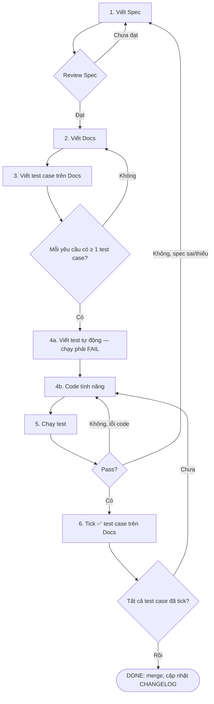
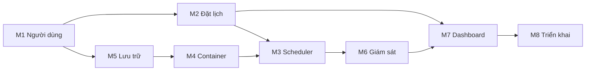

# Quy trình phát triển — Hệ thống đặt lịch GPU Server VMU

Tài liệu mô tả luồng phát triển đầy đủ cho hệ thống: **Spec → Docs → Test case trên Docs → Code → Chạy test → Tick**.
Một tính năng chỉ **xong** khi toàn bộ test case của nó đã được tick. Dự án chỉ **xong** khi mọi tính năng đều xong.

---

## 1. Nguyên tắc

1. **Spec là nguồn sự thật duy nhất.** Code và test đều phải truy ngược được về một yêu cầu trong spec.
2. **Không code khi chưa có test case trong Docs.** Mỗi yêu cầu có ít nhất 1 test case.
3. **Test viết từ Docs, không viết từ code.** Người viết test đọc docs, không đọc implementation.
4. **Chỉ tick khi test tự động pass**, bằng `tools/sync-ticks.js` từ báo cáo JUnit, trên code đã commit. Không tick vì "chạy thử bằng tay thấy ổn". (Tạm thời chưa có CI: chạy test và `sync-ticks` ở máy local.)
5. **Test fail thì sửa code, không sửa test.** Chỉ được sửa test khi spec thay đổi — và khi đó phải quay lại Bước 1.
6. **Không có "xong 90%".** Còn 1 ô chưa tick nghĩa là chưa xong.

## 2. Luồng tổng quát



## 3. Chi tiết từng bước

Mỗi bước có **Gate** — điều kiện bắt buộc trước khi sang bước tiếp theo.

### Bước 1 — Viết Spec

**Mục đích:** mô tả hệ thống *phải làm gì*, không mô tả *làm thế nào*.

Mỗi yêu cầu có ID dạng `REQ-<MODULE>-<số>`, dùng MUST/SHOULD, kèm tiêu chí chấp nhận Given/When/Then:

```markdown
### REQ-BK-03 — Giới hạn GPU
Tại mọi thời điểm, hệ thống MUST có tối đa 1 ca dùng GPU.

**Tiêu chí chấp nhận**
- Given đã có ca GPU 08:00–10:00
- When người dùng khác đặt ca GPU 09:00–11:00
- Then hệ thống từ chối với mã lỗi GPU_BUSY
```

**Gate:**
- [ ] Mọi yêu cầu có ID duy nhất và tiêu chí chấp nhận đo được
- [ ] Các tham số (28GB RAM, 100 GiB quota, 8h/ca, …) được liệt kê trong bảng cấu hình, không rải rác
- [ ] Đã có người review và đồng ý

### Bước 2 — Viết Docs

**Mục đích:** mô tả *hệ thống trông như thế nào từ bên ngoài* để người viết test không cần đọc code.

Nội dung bắt buộc:
- API: endpoint, request/response, mã lỗi (`400`, `403`, `409 SLOT_FULL`, `409 GPU_BUSY`, …)
- State machine của ca: `scheduled → starting → running → stopping → completed` (và `cancelled`, `failed`, `exited` — container tự thoát trước giờ, có thể khởi động lại trong ca)
- Lược đồ CSDL
- Lệnh Docker được sinh ra cho từng loại phiên
- Mỗi mục docs ghi rõ đang hiện thực `REQ-…` nào

**Gate:**
- [ ] Mọi `REQ-…` trong spec đều xuất hiện trong docs
- [ ] Mọi mã lỗi đều được liệt kê kèm điều kiện xảy ra

### Bước 3 — Viết test case trên Docs

Test case viết ngay trong docs dưới dạng checklist. Mỗi test case có: ID, yêu cầu liên quan, điều kiện đầu, thao tác, kết quả mong đợi.

```markdown
- [ ] **BK-T09** (REQ-BK-03) — Đã có ca GPU 08:00–10:00 của user A.
      User B đặt ca GPU 09:00–11:00 → `409 GPU_BUSY`, không có bản ghi mới.
```

Phải có đủ 3 loại:
- **Happy path** — trường hợp đúng
- **Negative** — dữ liệu sai, không có quyền
- **Edge case** — biên (ca kề nhau, đúng 8 giờ, hai request cùng lúc, …)

**Gate:**
- [ ] Mỗi `REQ-…` có ≥ 1 test case
- [ ] Mỗi mã lỗi trong docs có ≥ 1 test case gây ra nó

### Bước 4 — Code

**4a. Viết test tự động trước.** Tên test chứa ID test case để truy vết:

```js
test('BK-T09 từ chối ca GPU chồng lên ca GPU khác', async () => { ... });
```

Chạy test lúc này **phải fail** (chưa có code). Nếu pass nghĩa là test viết sai.

**4b. Viết code** đủ để test pass. Không thêm tính năng ngoài spec.

**Gate:**
- [ ] Mọi test case của tính năng đều có test tự động tương ứng
- [ ] Đã xác nhận test fail trước khi code

### Bước 5 — Chạy test

```bash
npm run test:unit          # logic thuần: kiểm tra xung đột, quota, port
npm run test:integration   # API + CSDL thật (MariaDB/Postgres trong Docker)
npm run test:system        # trên máy có GPU: container, cgroup, quota
npm run test:e2e           # Dashboard (Playwright)
```

Tạm thời **chưa dùng CI**: trước khi tick, chạy unit (với 3 giá trị `TZ`) + integration ở máy local trên code đã commit. System test (cần GPU thật) chạy trên server staging hoặc chạy tay có ghi log trước khi tick.

Khi test fail:
- **Lỗi code** → quay lại 4b.
- **Spec sai hoặc thiếu** → quay lại Bước 1, cập nhật spec → docs → test case, không được sửa thẳng test.

### Bước 6 — Tick

Chỉ tick khi test pass (hoặc log system test đính kèm), trên working tree sạch đã commit. Ghi kèm commit:

```markdown
- [x] **BK-T09** (REQ-BK-03) — ... → `409 GPU_BUSY`  ✅ `a1b2c3d`
```

Không tick bằng tay: `gpu-scheduler/tools/sync-ticks.js` đọc báo cáo JUnit và tự tick/bỏ tick trong docs. Test system chạy tay: lưu log vào `reports/system/<ID>.log` rồi chạy `node tools/sync-ticks.js --manual <ID>` (thiếu log thì không tick). Nếu một test đã tick mà sau đó fail lại (regression) thì script **bỏ tick** và tính năng quay về trạng thái chưa xong.

## 4. Ma trận truy vết

| REQ        | Mục Docs                 | Test case            | File code                       |
|------------|--------------------------|----------------------|---------------------------------|
| REQ-BK-02  | api.md#post-bookings     | BK-T07, T10–T12      | src/booking/conflict.js         |
| REQ-BK-03  | api.md#post-bookings     | BK-T08, BK-T09       | src/booking/conflict.js         |
| REQ-SC-01  | scheduler.md#start       | SC-T01, SC-T05       | src/scheduler/tick.js           |
| …          | …                        | …                    | …                               |

Bảng thật ở [`gpu-scheduler/docs/traceability.md`](gpu-scheduler/docs/traceability.md), **tự sinh** bằng `npm run trace` (không sửa tay), cập nhật mỗi lần merge. `npm run trace:check` chạy trên CI và fail nếu có REQ thiếu docs, thiếu test case, hoặc mã lỗi chưa có test case gây ra (Gate Bước 2–3).

## 5. Cấu trúc thư mục

```
gpu-scheduler/
├── docs/
│   ├── 00-spec/SPEC.md              # REQ-…, bảng cấu hình, câu hỏi cần review
│   ├── 10-design/
│   │   ├── api.md                   # endpoint, bảng mã lỗi
│   │   ├── database.md              # lược đồ CSDL, thuật toán kiểm tra xung đột
│   │   ├── scheduler.md             # state machine, tick, reconcile
│   │   ├── container.md             # lệnh docker run sinh ra
│   │   ├── storage.md               # quota, cấp phát tài khoản
│   │   ├── time.md                  # thời gian, múi giờ
│   │   ├── dashboard.md
│   │   └── deployment.md
│   ├── 20-test-cases/               # checklist test case, được tick — NGUỒN DUY NHẤT
│   │   ├── users.md  booking.md  scheduler.md  container.md
│   │   └── storage.md  monitoring.md  dashboard.md  deployment.md
│   └── traceability.md              # tự sinh
├── backend/
│   ├── src/{time,auth,users,booking,scheduler,container,storage,monitoring}/
│   └── tests/{unit,integration,system}/
├── frontend/
│   ├── src/
│   └── tests/e2e/
├── deploy/{systemd,nginx}/
├── reports/system/                  # log test system chạy tay
├── .github/workflows/ci.yml
└── tools/{trace.js,sync-ticks.js}
```

## 6. Thứ tự phát triển các module

Theo phụ thuộc: module sau cần module trước xong.



## 7. Danh sách test case theo module

Checklist gốc nằm ở [`gpu-scheduler/docs/20-test-cases/`](gpu-scheduler/docs/20-test-cases/README.md). Đây là **nguồn duy nhất**; không chép lại checklist vào file này để tránh hai bản lệch nhau. Mỗi dòng phải được tick trước khi module được coi là xong.

| Module | File | Số test case |
|---|---|---|
| M1 Người dùng & xác thực | [users.md](gpu-scheduler/docs/20-test-cases/users.md) | 32 |
| M2 Đặt lịch (cốt lõi) | [booking.md](gpu-scheduler/docs/20-test-cases/booking.md) | 42 |
| M3 Scheduler | [scheduler.md](gpu-scheduler/docs/20-test-cases/scheduler.md) | 15 |
| M4 Container & truy cập SSH | [container.md](gpu-scheduler/docs/20-test-cases/container.md) | 23 |
| M5 Lưu trữ | [storage.md](gpu-scheduler/docs/20-test-cases/storage.md) | 7 |
| M6 Giám sát & log | [monitoring.md](gpu-scheduler/docs/20-test-cases/monitoring.md) | 10 |
| M7 Dashboard | [dashboard.md](gpu-scheduler/docs/20-test-cases/dashboard.md) | 19 |
| M8 Triển khai | [deployment.md](gpu-scheduler/docs/20-test-cases/deployment.md) | 14 |
| **Tổng** | | **162** |

So với bản checklist trước (95 mục):
- Mỗi test case ghi rõ REQ, loại (`happy`/`negative`/`edge`) và tầng test (`unit`/`integration`/`system`/`e2e`/`manual`).
- Mỗi mã lỗi đều có test case gây ra nó (vd `EMAIL_NOT_VERIFIED`, `INVALID_STATE`, `NOT_FOUND`).
- Ca đăng ký theo giờ tròn ("từ 8 giờ đến 11 giờ"), 1 – 8 giờ; thêm nhóm test múi giờ: chuỗi thiếu múi giờ, offset khác +07:00, ca qua nửa đêm, ranh giới tuần theo giờ VN, chạy test với 3 giá trị `TZ`, Scheduler trên server UTC, trình duyệt ở múi giờ khác, NTP (BK-T33..T40, SC-T13, SC-T14, UI-T10, UI-T11, DP-T06). Xem [time.md](gpu-scheduler/docs/10-design/time.md).
- Thêm: ca không phải giờ tròn (BK-T24), hết grace period soft quota (ST-T07), thiếu `use_gpu` (BK-T25), image/cổng không hợp lệ ở API (BK-T31, T32), ca vắt qua ranh giới tuần (BK-T28), ưu tiên `GPU_BUSY` (BK-T29), restart sai trạng thái (SC-T11), Scheduler tắt suốt ca (SC-T12), không có phiên đăng nhập (US-T27), SSH key sai (US-T28), tái dùng dải cổng (US-T29), log quá hạn (MN-T05)…
- DP-T03 sửa cho khớp kế hoạch: host giữ 8 GB (tổng giới hạn container 56 GiB), không còn con số 6 GB.
- UI-T06 xếp lại đúng thứ tự.

## 8. Definition of Done

**Một tính năng xong khi:**
- [ ] Spec, docs, test case đã review
- [ ] 100% test case của tính năng đã tick trên CI (system test có log đính kèm)
- [ ] Ma trận truy vết đã cập nhật
- [ ] Code đã review và merge

**Dự án xong khi:**
- [ ] M1 → M8 đều đạt Definition of Done
- [ ] Toàn bộ test chạy lại một lượt trên server thật, không có test nào bỏ tick
- [ ] Chạy thử với người dùng thật ít nhất 1 tuần, không phát sinh lỗi mới chưa có test case

## 9. Khi phát hiện lỗi sau khi đã xong

1. Viết test case mới mô tả lỗi vào docs (chưa tick).
2. Viết test tự động → xác nhận fail.
3. Sửa code → test pass → tick.
4. Nếu lỗi do spec thiếu → cập nhật spec trước, rồi đi lại từ Bước 1.
